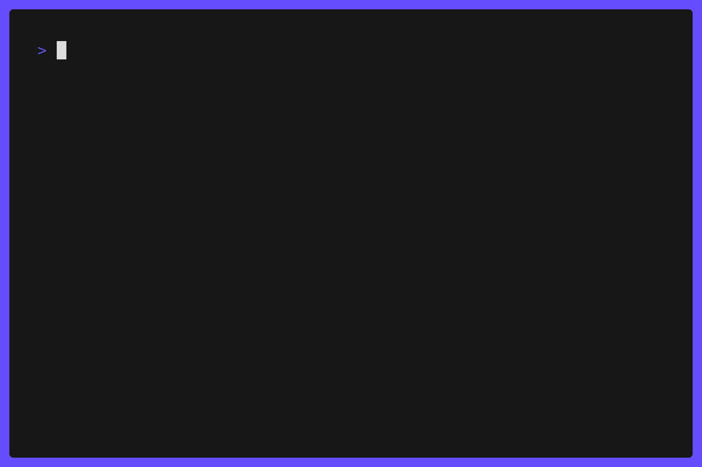

<div align="center">
  
</div>

```console
$ whoami
llunatic — security enthusiast from Indonesia.
I break things (legally), then write about it:
threat intel, EASM, and local AI tooling.
```

### now

- writing [**llunatic-lab**](https://lab.llunaticsys.web.id) — bilingual EN/ID security notes, 4× a week
- thesis: External Attack Surface Management (EASM)
- building Hermes — a local AI agent stack (Muse → 9Router → Telegram)

### stack


### stats


### elsewhere

[](https://lab.llunaticsys.web.id)
[](https://linkedin.com/in/andiko-ramadani)
[](https://instagram.com/dkorm_)
[](https://facebook.com/llunaticsys)
